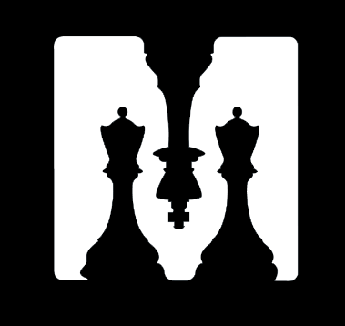

# ♟️	ChessMate - Microservice
<br />
<br />
<p align="center">
    
  </a>
  
  <h3 align="center"> Project for the course of Mobile Applications and Cloud Computing 2023/2024. </h3>
</p>


# 🏆 Our team:
```
Andrea Panceri, matricola: 1884749

Francesco Sudoso, matricola: 1808353
```

## 📱 ChessMate repository 

The application code can be reached through this <a href="https://github.com/Pancio-code/ChessMate-MACC">link</a>.


